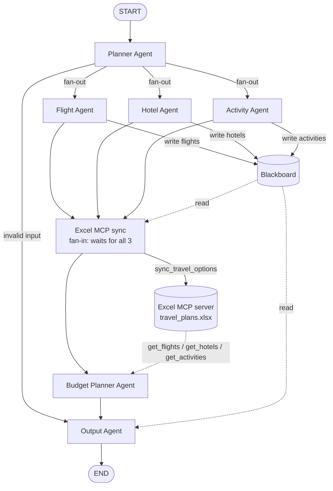

# Light Planning Multi-Agent Travel System

A lightweight multi-agent travel planner built with **LangGraph**. It is a simplified take on
[Travel-Planning-Multi-Agent-System](https://github.com/Shrouk-Adel/Travel-Planning-Multi-Agent-System).

You give it a destination, a travel date and a duration (plus an optional origin and budget).
Specialist agents then find flights, hotels and activities **in parallel** and write them to a
shared **Blackboard**. A sync step publishes the results to an **Excel workbook through MCP**. A
**Budget Planner Agent** reads them back through the Excel MCP tools and prices the combinations.
An **Output Agent** assembles the final Markdown plan.

It runs fully offline out of the box, using a bundled demo catalog. Add an LLM key to enable
free-text requests and LLM-assisted steps. Add a Tavily key for live web search.

---

## Architecture



| Step | Node | What it does |
|---|---|---|
| 1 | `planner_agent` | Validates destination, date and duration (Pydantic). Parses free text with the LLM if one is configured. Writes `trip_constraints` to the Blackboard. Routes to the 3 specialists in parallel, or straight to output when the input is invalid. |
| 2 | `flight_agent` / `hotel_agent` / `activity_agent` | Run **in the same LangGraph superstep**. Each one reads `trip_constraints` from the Blackboard, calls its tool, validates results into Pydantic models, and **writes** `flights` / `hotels` / `activities` to the Blackboard. Failures are caught and recorded as `status="failed"`. |
| 3 | `excel_sync` | Fan-in node that runs only after all three finish. It publishes the Blackboard options to Excel through the MCP tool `sync_travel_options`. |
| 4 | `budget_agent` | Reads the options **only through Excel MCP** (`get_flights`, `get_hotels`, `get_activities`), never from the Blackboard. Prices every flight-pair × hotel combination and selects one. |
| 5 | `output_agent` | Combines the request, the Blackboard and the budget result into Markdown. Missing data is labelled *Unavailable*. |

### Key design decisions

- **The Blackboard is injected, not global.** Each run creates its own `Blackboard(session_id)` and passes it through LangGraph's runtime context (`graph.ainvoke(..., context=TravelContext(...))`). Nodes reach it through `runtime.context.blackboard`. Access is guarded by an `RLock`, and reads and writes deep-copy their values, so an agent can't mutate another agent's data.
- **The LangGraph state stays small.** `TravelState` holds request fields, per-agent statuses, the budget result and the final plan. The specialist options live on the Blackboard. Each parallel specialist writes its own status key (`flight_status`, and so on), so parallel writes never conflict. `errors` uses an `operator.add` reducer.
- **The Excel MCP layer is isolated.** All openpyxl code lives in `app/mcp/excel_server.py`, a FastMCP stdio server. Agents talk to it only through `ExcelMCPClient`. Every row has a `session_id` column, re-syncing replaces that session's rows, and writes use a cross-process lock file plus an atomic replace.
- **Budget arithmetic is deterministic Python.** LLMs are unreliable at arithmetic. The LLM, when configured, only writes a short rationale about numbers that are already computed.
- **No fabrication.** The Output Agent renders from structured data, never from free LLM text. The optional LLM summary gets only the grounded JSON. The LLM extraction and scheduling outputs are validated: hallucinated activity names and incomplete flights are dropped. With no budget given, none is invented.
- **Graceful degradation.** Each specialist, the sync step and the budget step catch their own failures. The workflow always reaches the Output Agent, which reports what is missing.

### Budget selection rule

1. Build every combination: outbound flight × return flight × hotel.
2. Planned activities (the ones assigned to a day) are added. If a budget is set and the combination is over it, the most expensive paid activities are dropped first.
3. **With a budget:** pick the combination with the best-rated hotel that fits. If none fits, pick the cheapest and flag the overage.
4. **Without a budget:** pick the cheapest combination and show the top-rated one as an alternative.
5. Options priced in another currency are excluded, since there is no conversion. Food, local transport, visas and insurance are not estimated.

---

## Folder structure

```text
.
├── app/
│   ├── main.py                 # plan_trip() + CLI
│   ├── graph.py                # LangGraph wiring (fan-out / fan-in)
│   ├── state.py                # TravelState (TypedDict) + TravelContext (runtime DI)
│   ├── config.py               # pydantic-settings, reads .env
│   ├── llm.py                  # OpenAI-compatible client (structured JSON + text)
│   ├── excel_sync.py           # Blackboard -> Excel MCP sync node
│   ├── notifications/
│   │   └── email_sender.py     # SMTP delivery of the final plan (HTML + .md attachment)
│   ├── agents/
│   │   ├── planner_agent.py
│   │   ├── specialist.py       # shared read-constraints -> tool -> validate -> write flow
│   │   ├── flight_agent.py
│   │   ├── hotel_agent.py
│   │   ├── activity_agent.py
│   │   ├── budget_agent.py
│   │   └── output_agent.py
│   ├── blackboard/
│   │   ├── blackboard.py       # write / read / update / get_all, lock-protected
│   │   └── schemas.py          # BlackboardKeys, BlackboardEntry, SpecialistResult
│   ├── mcp/
│   │   ├── excel_server.py     # FastMCP server (openpyxl lives only here)
│   │   └── excel_client.py     # stdio MCP client used by agents
│   ├── tools/
│   │   ├── common.py           # ToolResult, providers (sample catalog / Tavily)
│   │   ├── flight_tools.py
│   │   ├── hotel_tools.py
│   │   └── activity_tools.py
│   ├── schemas/                # TravelRequest, FlightOption, HotelOption, ActivityOption, BudgetPlan, FinalTravelPlan
│   └── prompts/                # one prompt module per agent
├── data/
│   ├── sample_catalog.json     # DEMO data for offline runs (not live availability)
│   └── travel_plans.xlsx       # Flights / Hotels / Activities sheets (written via MCP)
├── examples/
│   ├── paris_request.json
│   └── paris_plan.md           # output of the example below
├── tests/
├── .env.example
├── requirements.txt
├── run.py                      # CLI
└── streamlit_app.py            # web UI + email delivery
```

---

## Setup

Requires Python 3.11 or newer (tested on 3.14).

```bash
python -m venv .venv
# Windows: .venv\Scripts\activate    macOS/Linux: source .venv/bin/activate
pip install -r requirements.txt
cp .env.example .env        # optional: every key has an offline default
```

### Environment variables

| Variable | Default | Purpose |
|---|---|---|
| `LLM_API_KEY` | *(empty)* | Enables LLM features. When empty, deterministic fallbacks are used. |
| `LLM_MODEL` | `gpt-4o-mini` | Model name at the endpoint |
| `LLM_BASE_URL` | *(empty = OpenAI)* | Any OpenAI-compatible endpoint (Groq, Ollama `http://localhost:11434/v1` with any non-empty key, ...) |
| `LLM_TEMPERATURE` | `0` | |
| `TRAVEL_DATA_PROVIDER` | `sample` | `sample` = bundled demo catalog; `tavily` = live web search + LLM extraction |
| `TAVILY_API_KEY` | *(empty)* | Required when `TRAVEL_DATA_PROVIDER=tavily` |
| `EXCEL_WORKBOOK_PATH` | `data/travel_plans.xlsx` | Workbook served by the Excel MCP server |
| `SMTP_HOST` / `SMTP_PORT` | `smtp.gmail.com` / `587` | SMTP server used by the Streamlit app (STARTTLS) |
| `SMTP_USERNAME` / `SMTP_PASSWORD` | *(empty)* | Sender account. For Gmail, use an **App Password** (requires 2-Step Verification). |
| `EMAIL_SENDER` | *(= SMTP_USERNAME)* | `From:` address |
| `EMAIL_RECIPIENT` | `vsalma.mohamed24@gmail.com` | Default recipient in the Streamlit app (editable in the sidebar) |

What the LLM is used for, when it is configured:

- Parsing free-text requests in the Planner.
- Extracting structured options from web results (Tavily provider).
- Grouping activities into days. The deterministic scheduler is the fallback.
- The budget rationale and the plan summary.

The sample catalog covers Paris, Rome, Dubai and Tokyo, with flights from Cairo, London and New York
on some routes. **Its prices are illustrative demo data**, and every plan built from it says so.

---

## How to run

```bash
# Structured fields
python run.py --destination Paris --date 2026-10-15 --duration 5 --origin Cairo --budget 1500 --currency USD

# JSON request file
python run.py --request examples/paris_request.json --out plan.md

# Free text (needs LLM_API_KEY)
python run.py --query "5 days in Paris from Cairo starting 15 Oct 2026, budget 1500 USD"

# Show agent logs (parallel specialists, MCP sync, budget)
python run.py --request examples/paris_request.json -v
```

### Streamlit app (web UI + email)

```bash
streamlit run streamlit_app.py
```

The form takes a destination, travel date and optional time, duration, an optional origin, and an optional budget and currency.
Submitting it runs the full agent workflow and shows:

- the Markdown plan
- the raw Blackboard contents
- the budget result read through Excel MCP

The plan is then emailed to `EMAIL_RECIPIENT` (default `vsalma.mohamed24@gmail.com`; you can change it in the sidebar)
as an HTML email with a plain-text version and `travel_plan.md` attached. There is also a
**Send plan by email** button and a download button. If SMTP is not configured, the plan is still
shown and the app explains why no email was sent.

From Python:

```python
import asyncio
from app.main import plan_trip

result = asyncio.run(plan_trip({"destination": "Rome", "travel_date": "2026-11-02", "duration_days": 3, "origin": "Cairo"}))
print(result.plan.markdown)          # final Markdown
result.blackboard.get_all()          # everything the specialists wrote
result.state["budget_result"]        # structured BudgetPlan
```

The Excel MCP server can also be run standalone, for example to attach it to another MCP client:
`python -m app.mcp.excel_server`. It exposes `sync_travel_options`, `get_flights`, `get_hotels`,
`get_activities`, `get_all_travel_options` and `get_cost_summary`.

### Tests

```bash
python -m pytest -q
```

The suite has 49 tests. Email is tested against a fake SMTP server, so no real mail is sent:

- **Blackboard:** read/write/update, copy isolation, concurrent updates.
- **Validation:** every malformed-input case.
- **Budget logic:** with and without a budget, over budget, partial data, currency filtering.
- **Excel MCP round-trip:** runs the real stdio server.
- **Graph:** the full run, a timing test that proves the specialists overlap, a flight failure, MCP down, invalid input, no origin, unknown destination, a check that the Budget Agent reads from MCP rather than the Blackboard, and the LLM paths with a fake LLM.

---

## Example

Input (`examples/paris_request.json`):

```json
{
    "destination": "Paris",
    "travel_date": "2026-10-15",
    "duration_days": 5,
    "origin": "Cairo",
    "budget": 1500,
    "currency": "USD"
}
```

Output (abridged; full version in [examples/paris_plan.md](examples/paris_plan.md)):

```markdown
# Travel Plan

- **Destination:** Paris
- **Travel date:** 2026-10-15
- **Duration:** 5 day(s), returning 2026-10-20
- **Origin:** Cairo
- **Budget:** 1,500.00 USD

## Flight

Selected by the Budget Agent:
- Outbound: **Turkish Airlines TK691/TK1827**: Cairo → Paris, departs 2026-10-15 04:10, arrives 2026-10-15 12:40 (9h 30m (1 stop IST)), 265.00 USD
- Return: **Turkish Airlines TK1822/TK690**: Paris → Cairo, departs 2026-10-20 07:15, arrives 2026-10-20 17:00 (8h 45m (1 stop IST)), 255.00 USD

## Hotel

Selected by the Budget Agent: **Hotel du Marais Central** (Le Marais, 3rd arr., rated 4.3/5): 165.00 USD/night, 825.00 USD total

## Activities

**Day 1 (2026-10-15)**
- Arrive on Turkish Airlines at 2026-10-15 12:40
- Louvre Museum [museum]: 3.0h, 24.00 USD
- Eiffel Tower summit [landmark]: 2.0h, 38.00 USD
...
**Day 5 (2026-10-19)**
- Le Marais food tour [food]: 3.0h, 95.00 USD (not included in budget)
- Luxembourg Gardens [park]: 1.5h, 0.00 USD

## Budget

| Item | Cost |
|---|---|
| Flight | 520.00 USD |
| Hotel | 825.00 USD |
| Activities | 138.00 USD |
| **Total** | **1,483.00 USD** |

Selection rule: Best-rated hotel within budget.
Budget: 1,500.00 USD, remaining: 17.00 USD.

- Compared 36 combination(s) built from the Excel data: 3 outbound flight(s) x 3 return flight(s) x 4 hotel(s).
- Activities: 8 scheduled = 138.00 USD (1 paid activity dropped to fit the budget).
...

## Notes

- Flight, hotel and activity data comes from the bundled **demo catalog**. Prices and schedules are illustrative, not live availability. Verify before booking.
```

When something fails, for example if the flight provider is down, the plan still gets produced:
the Flight section reads *"Flight information is unavailable: Flight search failed: ..."*, the budget
is marked `partial` with the flight cost excluded, and the Notes list the issue.
